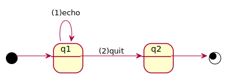

# Summary
[*dsl4sc*](https://github.com/ldltools/dsl4sc) is a domain-specific language,
based on [LDL](https://www.cs.rice.edu/~vardi/),
for defining, verifying, and running event-processing systems.

In *dsl4sc*,
each system is defined as a set of rules
in the [_event-condtion-action_](https://en.wikipedia.org/wiki/Event_condition_action) style.  
Then, it can be
(1) statically verified against particular formal properties in LDL, and/or
(2) translated int a statechart in [SCXML](https://www.w3.org/TR/scxml/)
and run as an executable program using a SCXML processor such as
[_scxmlrun_](https://github.com/ldltools/scxmlrun).

# Example: [echo](examples/echo/README.md)

(1) [*echo.rules*](examples/echo/echo.rules) is defined in *dsl4sc* as follows.

&ensp; **protocol**  
&ensp;&ensp; echo; echo\*;;  
&ensp;&ensp;&ensp; // sequence of *echo* events (repeated 1 or more times)  
&ensp; **rule**  
&ensp;&ensp; **on** echo **do** { console.log (_event.data); };  
&ensp;&ensp;&ensp; // upon each incoming *echo* event, print out its parameter

(2) [*echo.scxml*](examples/echo/out/echo.scxml) can be generated
from [*echo.rules*](examples/echo/echo.rules) as a semantically-equivalent
statechart in the [SCXML](https://www.w3.org/TR/scxml/) format.

run: `rules2scxml echo.rules -o echo.scxml`

(3) [echo.in](examples/echo/out/echo.in) is defined as an input scenario,
which includes the following input events

&ensp; {"event" : {"name" : "echo", "data" : "hello"}}  
&ensp; {"event" : {"name" : "echo", "data" : "world"}}

(4) To test *echo.scxml* against *echo.in*
using [scxmlrun](https://github.com/ldltools/scxmlrun), our SCXML interperter,

run: `scxmlrun echo.scxml echo.in`

The following messages should appear on your terminal.

&ensp; hello  
&ensp; world  

Take a look at [more examples](examples/README.md) if you are interested.

# Installation on Docker

- run `docker build --target builder -t ldltools/ldlsat-dev .` in the [ldlsat](https://github.com/ldltools/ldlsat) directory
- run `docker build -t ldltools/dsl4sc .` in this directory

# Installation on Debian/Ubuntu
## Prerequisites
- [ocaml](https://ocaml.org) (v4.05 or higher. tested with 4.07.0)  
  run: `apt-get install ocaml`  
  Alternatively, you can install a particular version of the compiler using opam  
  run: `opam switch 4.07.0` for example
- [opam](https://opam.ocaml.org) (ocaml package manager)  
  run: `apt-get install opam`
- ocaml packages: ocamlfind, sedlex, menhir, yojson, ppx\_deriving, ppx\_deriving\_yojson, xml-light  
  for each of these packages,  
  run: `opam install <package>`
- [ldlsat](https://github.com/ldltools/ldlsat)  
  run: `git clone https://github.com/ldltools/ldlsat`  
  build & install the tool by running `make && make install` in the top directory.  
  By default, its library modules will be installed to `/usr/local/lib/ldlsat`.
- [mona](http://www.brics.dk/mona/) (v1.4)  
  run: `wget http://www.brics.dk/mona/download/mona-1.4-17.tar.gz`  
  expand the archive, and build/install the tool as is instructed.
- [xqilla](http://xqilla.sourceforge.net/) and [xmllint](http://xmlsoft.org/)  
  run: `apt-get install xqilla libxml2-utils`
- [scxmlrun](https://github.com/ldltools/scxmlrun) (optional, for running/testing generated SCXML files)  
  run: `git clone https://github.com/ldltools/scxmlrun`  
  build & install the tool by running `make && make install` in the top directory.  
  By default, the binaries will be installed into `/usr/local/bin`.
- [graphviz](http://www.graphviz.org/) (optional)  
  run: `apt-get install graphviz`

## Build
- run `make && make install` in the top directory  
  Tools will be created and installed into `/usr/local/bin`.  
  To change the installation directory,
  run `make PREFIX=<prefix> install` instead (default: `PREFIX=/usr/local`).

# Installation on Darwin
In addition to the tools listed above, you also need the following GNU tools:

- GNU common utilities  
  run: `brew install coreutils debianutils`
- GNU sed/awk  
  run: `brew install gnu-sed gawk`
- GNU make (v4.1 or higher)  
  run: `brew install remake`

# Testing
- run: `make -C tests scxml`  
  SCXML files will be generated from rules definitions and stored into `tests/out`
- run: `make -C tests dfa`  
  DFA files will be generated in `tests/out`
