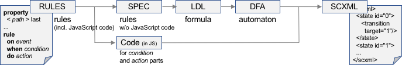

# Summary
[*dsl4sc*](https://github.com/ldltools/dsl4sc) is a domain-specific language
for concisely defining [_smart contracts_](https://en.wikipedia.org/wiki/Smart\_contract) and translating them to executable forms.
Each smart contract can be defined as a set of _protocols_, _properties_ and _rules_:
Protocols define (regular expression-like) patterns of *events*,
whereas properties define logical constraints among internal states
in [LDL](https://www.cs.rice.edu/~vardi/) that the contract needs to meet.
Rules on the other hand define how particular incoming events should be processed
in the [_event-condtion-action_](https://en.wikipedia.org/wiki/Event_condition_action) style.  
*dsl4sc* translates each smart contract definition
to [SCXML](https://www.w3.org/TR/scxml/), which can be either directly executed
by running those SCXML interpreters
such as [_scxmlrun_](https://github.ibm.com/trl-ccflow/ccflow) and [JSScxml](https://jsscxml.org/),
or compiled to a semantically-equivalent [_chaincode_](http://hyperledger-fabric.readthedocs.io/en/latest/chaincode.html) in the [go](https://golang.org/) language
by using the [_ccflow_](https://github.ibm.com/trl-ccflow/ccflow) SCXML processor
for execution on the [Hyperledger](https://www.hyperledger.org/projects/fabric) blockchain platform.

.

# Example: [echo](examples/echo/README.md)

[*echo.rules*](examples/echo/echo.rules) is defined as follows.

&ensp; **protocol**  
&ensp;&ensp; echo; echo\*;;  // seq of *echo* events (repeated 1 or more times)  
&ensp; **rule**  
&ensp;&ensp; **on** echo **do** { console.log (_event.data[0]); }; // prints out the first parameter of each incoming *echo* event

To generate, from [*echo.rules*](examples/echo/echo.rules), a statechart in [SCXML](https://www.w3.org/TR/scxml/)
as [*echo.scxml*](examples/echo/out/echo.scxml),  
run: `make -C examples/echo scxml` after installation is complete.

To execute [*echo.scxml*](examples/echo/out/echo.scxml) using scxmlrun,  
run: `make -C examples/echo run`  
This raises 2 *echo* events -- echo("hello") and echo ("world") -- which are consumed by [*echo.scxml*](examples/echo/out/echo.scxml)
and the following messages are printed out on your terminal.

&ensp; hello  
&ensp; world  

Take a look at [more examples](examples/README.md) if you are interested.

# Installation on Docker

- run `docker build --target builder -t ldltools/ldlsat-dev .` in the [ldlsat](https://github.com/ldltools/ldlsat) directory
- run `docker build -t ldltools/dsl4sc .` in the this directory

# Installation on Debian/Ubuntu
## Prerequisites
- [ocaml](https://ocaml.org) (v4.05 or higher. tested with 4.07.0)  
  run: `apt-get install ocaml`  
  Alternatively, you can install a particular version of the compiler using opam  
  run: `opam switch 4.07.0` for example
- [opam](https://opam.ocaml.org) (ocaml package manager)  
  run: `apt-get install opam`
- ocaml packages: ocamlfind, sedlex, menhir, yojson, ppx\_deriving, ppx\_deriving\_yojson, xml-light  
  for each of these packages,  
  run: `opam install <package>`
- [ldlsat](https://github.com/ldltools/ldlsat)  
  run: `git clone ssh://github.com/ldltools/ldlsat`  
  build & install the tool by running `make && make install` in the top directory.  
  By default, its library modules will be installed to `/usr/local/lib/ldlsat`.
- [mona](http://www.brics.dk/mona/) (v1.4)  
  run: `wget http://www.brics.dk/mona/download/mona-1.4-17.tar.gz`  
  expand the archive, and build/install the tool as is instructed.
- [xqilla](http://xqilla.sourceforge.net/) and [xmllint](http://xmlsoft.org/)  
  run: `apt-get install xqilla libxml2-utils`
- [scxmlrun](https://github.ibm.com/trl-ccflow/ccflow) (optional, for running/testing generated SCXML files)  
  run: `git clone ssh://github.ibm.com/trl-ccflow/ccflow`  
  build & install the tool as instructed.  
- [graphviz](http://www.graphviz.org/) (optional)  
  run: `apt-get install graphviz`

## Build
- run `make && make install` in the top directory  
  Tools will be created and installed into `/usr/local/bin`.  
  To change the installation directory,
  run `make PREFIX=<prefix> install` instead (default: `PREFIX=/usr/local`).

# Installation on Darwin
In addition to the tools listed above, you also need the following GNU tools:

- GNU common utilities  
  run: `brew install coreutils debianutils`
- GNU sed/awk  
  run: `brew install gnu-sed gawk`
- GNU make (v4.1 or higher)  
  run: `brew install remake`

# Testing
- run: `make -C tests scxml`  
  SCXML files will be generated from rules definitions and stored into `tests/out`
- run: `make -C tests dfa`  
  DFA files will be generated in `tests/out`
