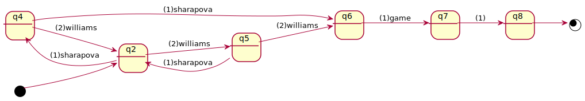

# Summary

[*dsl4sc*](https://github.com/ldltools/dsl4sc) is a domain-specific language,
based on [LDL<sub>f</sub>](https://www.cs.rice.edu/~vardi/),
primarily targeted at defining and verifying state transition models for event processing.

Each model in dsl4sc has the following unique characteristics:

- can include the following 3 different sorts of declarations:
  - event **protocol**:
    _regular_ pattern of acceptable event sequences
  - logical **property**:
    temporal LDL<sub>f</sub> formula the model should meet.
  - ECA **rule**:
    triple of _event_, _condition_, and _action_
    that defines how to respond to the specified incoming event.
- has a clear semantics in terms of the LDL<sub>f</sub> formalism.
- can be verified statically and formally against arbitrary requirements
  that are also defined in dsl4sc.
- can derive an executable statechart in [SCXML](https://www.w3.org/TR/scxml/).

# Example: [deuce](examples/deuce/README.md) -- Sharapova vs. Williams

Consider 2 professional tennis players, fictitiously called Sharapova and Williams,
are fighting for winning a game.
They are currently at deuce and either needs to win by 2 points ahead of her opponent.

To model what can happen through the game,
let us start with the following protocol definition

```
protocol  
(sharapova; williams + williams; sharapova)*;  
(sharapova; sharapova + williams; williams);  
game ;;
```

This protocol defines that the game proceeds through 3 stages:
(1) either takes an adavante but the other immediately evens the game,
which repeats 0 or more times, and
(2) either takes 2 points consecutively, and
(3) the judge declares the game is taken.

Succeedingly, to define how _computation_ proceeds through the game,
we introduce a variable, `state`, which ranges over 0 through 2 and denotes
if the games is either at deuce (0), advantaged (1), or taken (2).
In terms of this varible,
we define a set of formulas, as properties of the model, as follows,

```
variable  
state : nat(3);  
  // nat(3) = {0, 1, 2}  
  // 0: deuce, 1: advantage with either sharapova or williams, 2: ahead by 2 points  
property  
state = 0 && [](last -> state = 2);  
  // initial and final conditions  
<{state != 2}*; {state = 2}; {state = 2}> last;  
  // state = 2  only in the last 2 steps  
[] !(<{state = 0}> state = 0 || <{state = 1}> state = 1);  
  // state = 0/1 never repeats
```

By combining all of these, we derive a state-transition model illustrated as follows.



Once a model is defined, we can formally verify the model in various ways.
For examples, we can verify the following formulas all hold.

- `protocol sharapova; sharapova; game ;;` : straight-win (reachable)
- `property <{state = 0}; {state != 0}*> state = 2;` : straight-win (reachable)
- `property []<> state = 2;` : liveness

Take a look at [this](examples/deuce/README.md) for the detail.

You can also check out [more examples](examples/README.md) if you are interested.  


# Installation on Docker (recommended)

- run `docker build --target builder -t ldltools/ldlsat-dev .` in the [ldlsat](https://github.com/ldltools/ldlsat) directory
- run `docker build -t ldltools/dsl4sc .` in this directory

# Installation on Debian/Ubuntu
## Prerequisites
To run dsl4sc for static verification, you need the following tools.

- [ocaml](https://ocaml.org) (v4.05 or higher. tested with 4.10.0)  
  run: `apt-get install ocaml`  
  Alternatively, you can install a particular version of the compiler using `opam`  
  run: `opam switch create 4.10.0` for example
- [opam](https://opam.ocaml.org) (ocaml package manager v2.0)  
  run: `apt-get install opam`
- ocaml packages: ocamlfind sedlex menhir yojson ppx\_deriving ppx\_deriving\_yojson xml-light z3  
  for each of these packages,  
  run: `opam install <package>`
- [ldlsat](https://github.com/ldltools/ldlsat) (v1.0.4 or higher)  
  run: `git clone https://github.com/ldltools/ldlsat`  
  build & install the tool by running `make && make install` in the top directory.  
  By default, its library modules will be installed to `/usr/local/lib/ldlsat`.
- [mona](http://www.brics.dk/mona/) (v1.4)  
  run: `wget http://www.brics.dk/mona/download/mona-1.4-18.tar.gz`  
  expand the archive, and build/install the tool as is instructed.
- [xqilla](http://xqilla.sourceforge.net/) and [xmllint](http://xmlsoft.org/)  
  run: `apt-get install xqilla libxml2-utils`

## Prerequisites (optional)
To test generated SCXML files, you further need to install `scxmlrun`.

- [scxmlrun](https://github.com/ldltools/scxmlrun)  
  run: `git clone https://github.com/ldltools/scxmlrun`  
  build & install the tool by running `make && make install` in the top directory.  
  By default, the binaries will be installed into `/usr/local/bin`.

## Build
- run `make && make install` in the top directory  
  Tools will be created and installed into `/usr/local/bin`.  
  To change the installation directory,
  run `make PREFIX=<prefix> install` instead (default: `PREFIX=/usr/local`).

# Installation on macOS (Darwin)
In addition to the tools listed above, you also need the following GNU tools:

- GNU common utilities  
  run: `brew install coreutils debianutils`
- GNU sed/awk/bash  
  run: `brew install gnu-sed gawk bash`
- GNU make (v4.1 or higher)  
  run: `brew install remake`  
  and build by `MAKE=remake remake` instead of `make`

# Testing

- run: `make -C tests test`  
  run test cases using `rulessat`, `rulesmc`, and `rules2scxml`.
