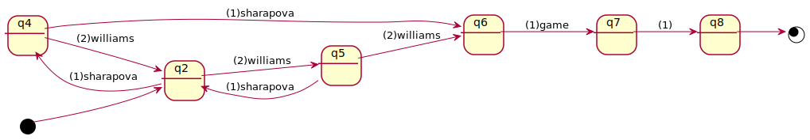

# deuce



## [deuce](deuce.dsl)

### protocol

```
protocol  
(sharapova + williams)*; game ;;
```

### state variable and its initial condition

```
variable  
state : nat(4); // nat(4) = {0, 1, 2, 3}  
  // 0: deuce  
  // 1: advantage with sharapova  
  // 2: advantage with williams  
  // 3: game set  
property  
state = 0;
```

### rules

```
rule  
on sharapova when state = 0 ensure state = 1;  
on sharapova when state = 1 raise game ensure state = 3;  
on sharapova when state = 2 ensure state = 0;  
on sharapova when state = 3 ensure false;  
...
```


## Formal verification

(to be filled in)
