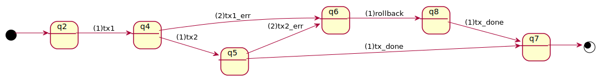

# composite transaction

When performing a composite transaction that involves 2 (or more) unit transactions,
it is crucial to ensure its _atomicity_.

Suppose a composite transaction involving 2 unit transactions, `tx1` and `tx2`.  
For atomicity,
it must hold that the transaction ends up with either of the following 2 cases.

- _both_ `tx1` and `tx2` succeed
- _neither_ succeeds (rollbacked)



## protocol

Such atomicity requirement can be defined as dsl4sc specification as follows:

```
protocol tx1; (tx1_err; rollback + tx2; (tx2_err; rollback)?);;
```

This protocol specifies that

- the first event is `tx1`, invoking the first of the two transactgions,
  which is followed by `(.. + ..)` that includes the following 2 cases
- [case1] `tx1_err; rollback`  
  `tx1_err` is emitted, indicating faiure of `tx1`, which is immediately followed by `rollback`
- [case2] `tx2; (tx2_err; rollback)?`  
  `tx1` succeeds, and `tx2` is emitted subsequently.
  If it succeeds as well, the composition transaction terminates successfully.
  Otherwise, `tx2_err` and `rollback` are emitted in the same way as `tx1` fails.
