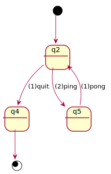

# Testcase: ping\_pong

## [ping_pong.spec](ping_pong.spec)



## [ping\_pong.js](ping_pong.js)

```
export function ping () { console.log ("ping!"); }  
export function pong () { console.log ("pong!"); }
```

## ping\_pong.js (safeguarded)

Give the above 2 files, we attach pre/post conditions, generated from the spec,
to the event-handler functions in the code.

```
$ safeguard ping_pong.js --spec ping_pong.spec
```

This generates the following lines of code.

```
export function ping() {
  assert(_state == "q2");
  console.log("ping!");
  _state_pre = _state;
  _state = _state == "q2" ? "q5" : null;
  assert(_state_pre == "q2" && _state == "q5");
}
export function pong() {
  assert(_state == "q5");
  console.log("pong!");
  _state_pre = _state;
  _state = _state == "q5" ? "q2" : null;
  assert(_state_pre == "q5" && _state == "q2");
}
var _state = "q2", _state_pre;
```

# Testcase: deuce

## [deuce.spec](deuce.spec)

## [deuce.js](deuce.js)


# Testing

```
$ make test
```
